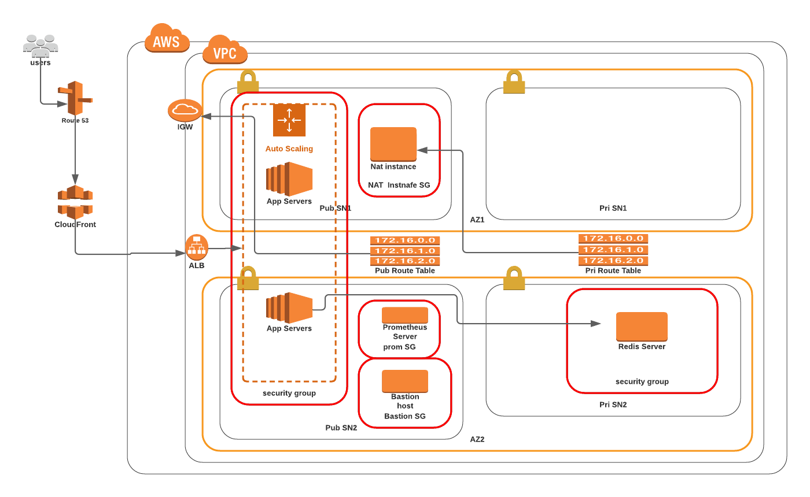

# RediSolar Data Center

## Architecture Diagram



[](https://circleci.com/gh/tutugodfrey/redis-solar)

This Infrastructure is provision on the AWS Cloud Platform using AWS CloudFormation Stacks which provide the way for deploying the infrastructure in an automated way. The resource provision in this infrastructure closely mirror what is in the diagram above.  The cloud formation stacks for deploying the infracture is found in the `/redis-solar/aws-cloud-infra/cloudformation-templates` directory. Below are the various stacks, and thier functions. This README.md file will be updated whenever there are changes to the infrastructure.

**redis-solar-vpc-stack.yml:** Create the VPC network, two private subnets and two public subnets across two availability Zone.

**security-groups-stack.yml:** Create the various security groups that will be requires for the various EC2 iinstances that we will be launching in our infrastructure.

**natinstance-stack.yml:** Create two nat instances across the two public subnet, and have route definition that allow traffic from the two private subnets to reach the internet.

**loadbalancer-stack.yml:** The Load Balancer stack will provision a load balancer to clients to access the web application.

**jump-stack.yml:** The jump stack will provision Bastion host that will act as administrative interface for the infrastructure.

**redis-db-stack.yml:** This will create the EC2 instance, Install and configure Redis DB server on the instance. The script for installing the Redis DB server itself is found in the project root directory. It will be clone during the installation process.

**frontend-stack.yml:** The frontend stack will provision the frontend web app using ec2 autoscaling configuration.

**backend-stack.yml:** The backend stack will provision the backend server(s) using EC2 autoscaling in the private subnets.

**Notes:** 

- Each of the above mention stacks have a corresponding parameters.json file that is requires to keep certain parameters. Importantly, the parameters **ProjectName** and **EnvironmentName** appear in all the stack. For any particular deployment, the **ProjectName** and **EnvironmentName** must be the same across all stacks to ensure that resources are provisioned in a properly namespaced way. The are used throught the stacks for exporting and importing values from other stacks.

- The stack are seperated into varios files to ensure that each can be managed seperately. This is because not all the stacks may need to undergo a frequent change after the initial deploy. For example the VPC stack will relatively stay the same for a long time. 


## Initial Infrastructure provisioning

The initial provisioning of the infrastructure can be done be executing the `/redis-solar/aws-cloud-infra/cloudformation-templates/deploy-stacks.sh` script. The script will provision the following resources in order

- Create VPC network and subnets 
- Create security groups that is required for other stacks
- Create Elastic Load Balancer
- Create a Bastion host /Jump server
- Create the redis DB server
- Create NAT instances
- Create the frontend web app
- Create the backend web server

To execute the script

- 1 Change directory to the to the stacks directory assuming you are in the project root directory.

```
cd ./redis-solar/aws-cloud-infra/cloudformation-templates/

```

- 2 Execute `deploy-stacks.sh` to provision the resources.

```
./deploy-stacks.sh

```

**Please Note:**  Each of the stack have their correspoinding paramater files that you may need to change before executing the script. But it is necessary to keep **ProjectName** and **EnvironmentName** variable the sample across all stacks. This help to ensure resources are tag appropriately base on the evnrionment and project name, thus providing resource namespace.

## Updating stacks

After the initial provisioning of the resources, further update or change can be made by targeting specific stacks. The`stack-helper.sh` scription contains functions to help with managing stacks.

- 1 Source the file  by executing the following command

```
. ./stack-helper.sh

```
or use the -h or --help to get help with parameters

```
. ./stack-helper.sh -h

```
After sourcing the file, you are able to executing the following  functions by providing the appropriate parameters where needed. Use the `-h` or `--help` option to get more information.

```
create_stack STACK_NAME TEMPLATE_BODY_FILE PARAMETERS_FILE : Create a stack 
  
update_stack STACK_NAME TEMPLATE_BDOY_FILE PARAMETERS_FILE : Update a stack

delete_stack STACK_NAME  : Delete a stack

describe_stack STACK_NAME : Describe a stack

list_stack : list stacks in your account

```

**Note:** Effort was made to ensure the stack file and the parameter file resemble each other to avoid confusion about which is which.
